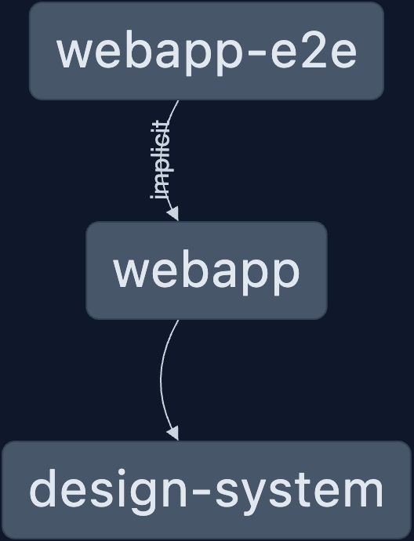

# Final Year Project

## Overview

✨ **This workspace has been generated by [Nx, Smart Monorepos · Fast CI.](https://nx.dev)** ✨, it contains the following packages:


1. [webapp](./packages/webapp) Including the source code for the Frontend web application, and Backend migrations/hooks
2. [design-system](./packages/design-system/) [PandaCSS](https://panda-css.com/) Configuration for design tokens used by the Frontend
3. [webapp-e2e](./packages/webapp-e2e/) E2E tests for the web application, currently missing the manual tests specified in the main document.

## Pre-requisites

1. Install [pnpm](https://pnpm.io/installation)
1. Install packages using `pnpm install` at the root of the workspace.
1. Download and extract the [pocketbase executable v0.22.5](https://github.com/pocketbase/pocketbase/releases/tag/v0.22.5) from the assets section, and place it at `packages/webapp`
1. Run the [Backend](#running-the-backend)
1. Run the [Frontend](#running-the-frontend)


## Running the Backend

The Backend is written using [pocketbase](https://pocketbase.io/docs/), and can be run as follows:

```sh
# Assuming the binary is extracted and named pocketbase_bin
cd packages/webapp
./pocketbase_bin serve
```


## Running the Frontend

The frontend is written in vite, and can be started from the workspace as follows

```sh
pnpm nx run webapp:dev
```


## Explore the project graph

A preview of the Project Graph: 



You can also run `pnpm nx graph` to show the graph of the workspace.
It will show tasks that you can run with Nx.

- [Learn more about Exploring the Project Graph](https://nx.dev/core-features/explore-graph)


## Nx Console

Enhance your Nx experience by installing [Nx Console](https://nx.dev/nx-console) for your favorite editor. It makes it easier to view the project structure and available commands